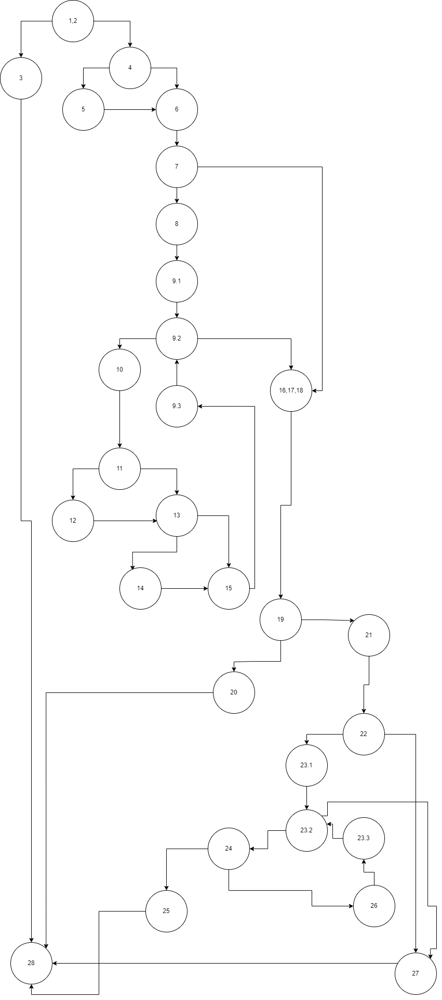
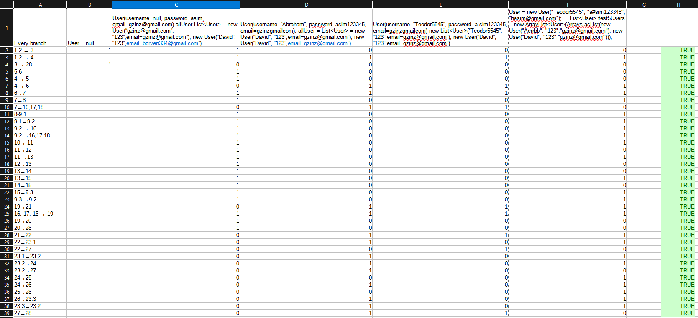
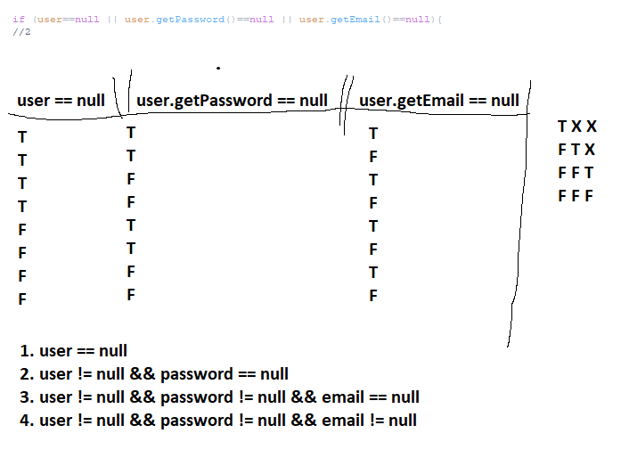

# SI_2023_lab2_213213
1. Ivan Ristov 213213

2. Control flow graph од дадениот код

3. Цикломатската комплексност на графот изнесува 11. Ова го добив со броење на регионите на control flow grafot.

4. Every branch критерум тест случаеви

Користени тестови:
1. User = null 
2. User(username=null, password=asim, email=gzinz@gmail.com) allUser List<User> = new User(“gzinz@gmail.com”, “123”,email=gzinz@gmail.com”), new User(“David”, “123”,email=bcrven334@gmail.com”)
3. User(username=”Abraham”, password=asim123345, email=gzinzgmailcom), allUser = List<User> = new User(“David”, “123”,email=gzinz@gmail.com”), new User(“David”, “123”,email=gzinz@gmail.com”)
4. User(username=”Teodor5545”, password=a sim123345, email=gzinzgmailcom) new List<User>(“Teodor5545”, “123”,email=gzinz@gmail.com”), new User(“David”, “123”,email=gzinz@gmail.com”) 
5. User = new User("Teodor5545", "a#sim123345", "hasim@gmail.com");     List<User> test5Users = new ArrayList<User>(Arrays.asList(new User("Aerrbb", "123","gzinz@gmail.com"), new User("David", "123","gzinz@gmail.com")));

5. Multiple Condition критериум за условот if (user==null || user.getPassword()==null || user.getEmail()==null).

- User nullUser = null; 
- User nullPassword = new User("",null,"");
- User nullEmail = new User("","",null);
- User noException = new User("","","");